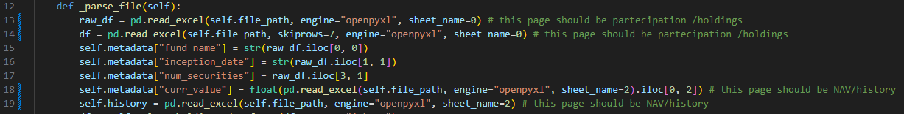

## ETF Portfolio Analyzer
If you’re anything like me, you’ve probably bought a variety of ETFs — a bit of S&P 500 here, some STOXX 600 there, maybe ACWI and ACWI ex US too. Now you’re left wondering: what exactly is my portfolio’s exposure in terms of geography, currency, sectors, or asset classes?

This Python-based tool helps you answer exactly that — so you can keep shopping for ETFs while staying in control of your overall financial exposure.

## 📓 How the Main Notebook Works

The core logic is contained in the main Jupyter Notebook (`main.ipynb`), which guides you through the entire portfolio analysis workflow.

### 🧭 Workflow Overview

1. **Load ETF Files**
   - The notebook scans the `etf_data/` folder for iShares `.xlsx` and Amundi `.csv` files.
   - Files are parsed into ETF objects using custom classes (`IShareETF`, `AmundiETF`).

2. **User Input: Quotas**
   - A small GUI (Tkinter-based) prompts you to enter the number of quotas held for each ETF.

3. **Calculate Portfolio Exposure**
   - Based on the holdings and quota value, exposures are calculated for:
     - 🌍 Geographic (`Location`)
     - 🏦 Sector
     - 💱 Currency
     - 🧱 Asset Class
   - Exposures can be computed globally (portfolio-level) or per ETF.

4. **Visualization**
   - Exposure distributions are plotted using Matplotlib pie charts.

5. **Export**
   - Final results are saved as `.csv` files in the `analysis_data/` folder for record-keeping and further analysis.

---

### 📌 Tip:
You can modify the grouping column (e.g., `'Sector'`, `'Currency'`) using the `compute_portfolio_exposure()` function:

```python
compute_portfolio_exposure(ETF_list, quotas_dict, group_by='Sector')

```
---
## 📁 Input Files — Store in the `etf_data` Folder

This project parses ETF data (e.g., holdings, historical NAV) from files **manually downloaded from ETF provider websites**.

Please read the instructions below carefully to ensure proper formatting and file placement.


---

## 🟢 iShares ETFs

iShares provides downloadable Excel files with all the necessary data.

### ✅ Steps:
1. Go to the ETF’s page, e.g.  
   [iShares MSCI ACWI UCITS ETF](https://www.ishares.com/it/investitori-professionali/it/prodotti/251850/ishares-msci-acwi-ucits-etf?switchLocale=y&siteEntryPassthrough=true)
2. In the **top-right corner**, download the Excel file:  
   
3. Convert the downloaded `.xls` file to `.xlsx`.
4. Save the `.xlsx` file in the `etf_data` folder.

In the Italian version of this IShare document, in the first page you have "partecipations/holdings" and in the third the NAV (history) - if in your country the situation is different (IShare should really standardize their document), you are going to have to modify the IShare class and change the page that read_excell function imports in line 13-14 (sheet_name=0 if partecipation is the first sheet and so on), 18-19 (sheet_name=2 cause now it is the third).


---

## 🟠 Amundi ETFs

For Amundi ETFs, **you need two separate files**:

### 1. 📉 NAV History
- Found at the top of the ETF page next to the latest NAV.
- Usually named like `NAV Storiche_...`.
- Save it as a **`.csv` file**.


I will add additional classes when I will need them!
---

### 2. 📄 Fund Holdings (`Titoli detenuti`)
- Found under the *Composition* or *Portfolio* section of the ETF page.
- Also save this as a **`.csv` file**.


Place both `.csv` files in the `etf_data` folder.  
Example ETF page:  
[Amundi STOXX Europe 600 UCITS ETF](https://www.amundietf.it/it/professionali/products/equity/amundi-stoxx-europe-600-ucits-etf-acc/lu0908500753)


---

## 🧠 Notes

- File names are automatically parsed, so **do not rename downloaded files** unless instructed.
- Ensure consistent formatting (e.g., decimal separators) when converting.
- The script requires both NAV and Holdings files for Amundi ETFs to work correctly.
