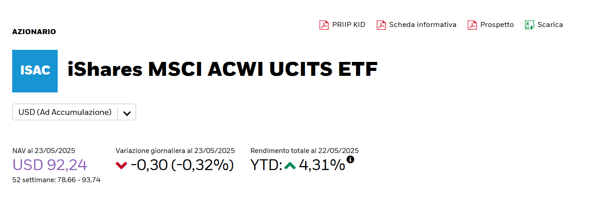
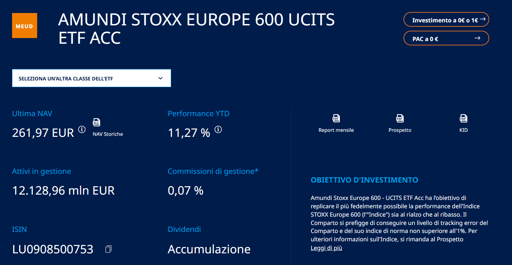
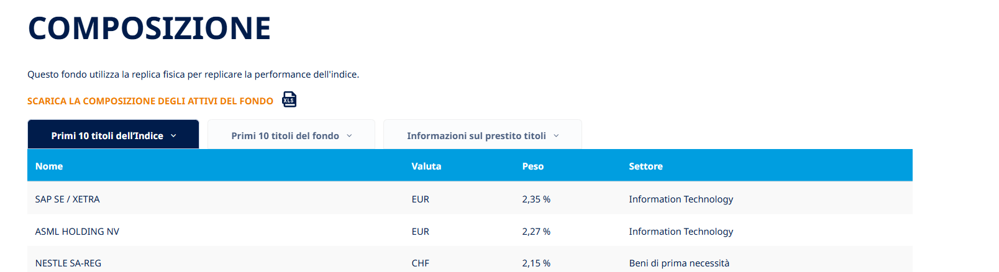

## 📁 Input Files — Store in the `etf_data` Folder

This project parses ETF data (e.g., holdings, historical NAV) from files **manually downloaded from ETF provider websites**.

Please read the instructions below carefully to ensure proper formatting and file placement.

---

## 🟢 iShares ETFs

iShares provides downloadable Excel files with all the necessary data.

### ✅ Steps:
1. Go to the ETF’s page, e.g.  
   [iShares MSCI ACWI UCITS ETF](https://www.ishares.com/it/investitori-professionali/it/prodotti/251850/ishares-msci-acwi-ucits-etf?switchLocale=y&siteEntryPassthrough=true)
2. In the **top-right corner**, download the Excel file:  
   
3. Convert the downloaded `.xls` file to `.xlsx`.
4. Save the `.xlsx` file in the `etf_data` folder.

---

## 🟠 Amundi ETFs

For Amundi ETFs, **you need two separate files**:

### 1. 📉 NAV History
- Found at the top of the ETF page next to the latest NAV.
- Usually named like `NAV Storiche_...`.
- Save it as a **`.csv` file**.

---

### 2. 📄 Fund Holdings (`Titoli detenuti`)
- Found under the *Composition* or *Portfolio* section of the ETF page.
- Also save this as a **`.csv` file**.

Place both `.csv` files in the `etf_data` folder.  
Example ETF page:  
[Amundi STOXX Europe 600 UCITS ETF](https://www.amundietf.it/it/professionali/products/equity/amundi-stoxx-europe-600-ucits-etf-acc/lu0908500753)

---

## 🧠 Notes

- File names are automatically parsed, so **do not rename downloaded files** unless instructed.
- Ensure consistent formatting (e.g., decimal separators) when converting.
- The script requires both NAV and Holdings files for Amundi ETFs to work correctly.
